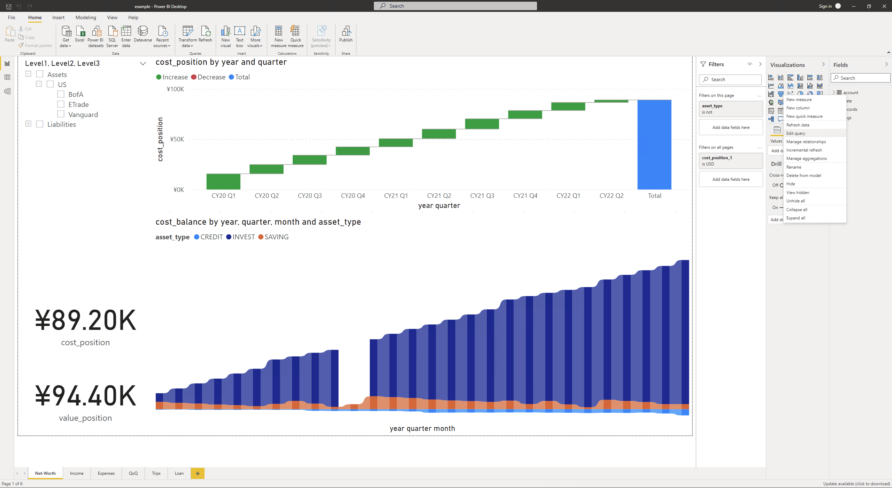
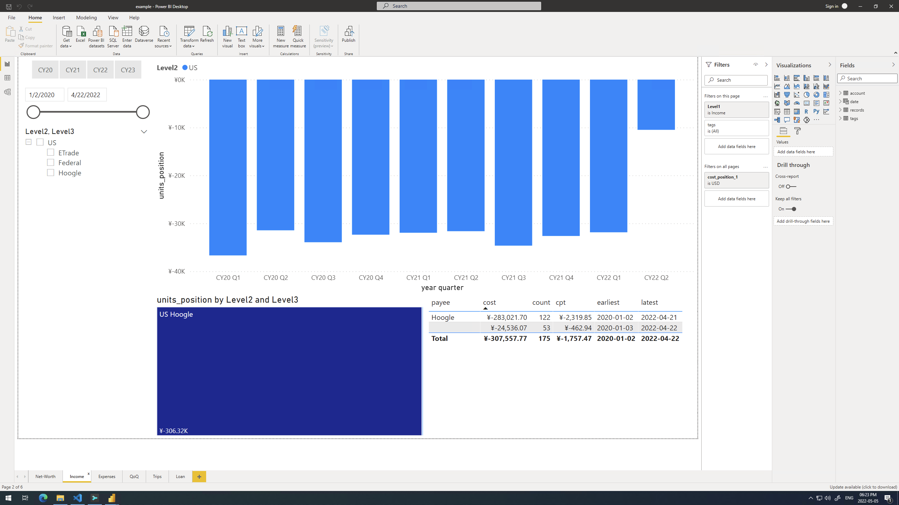
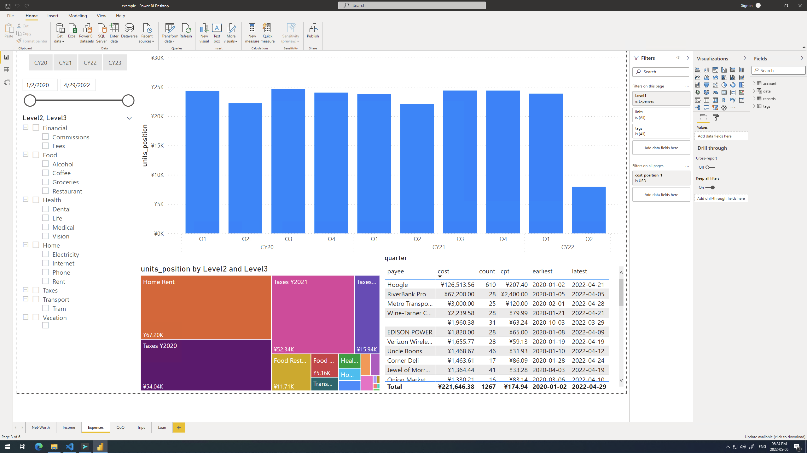
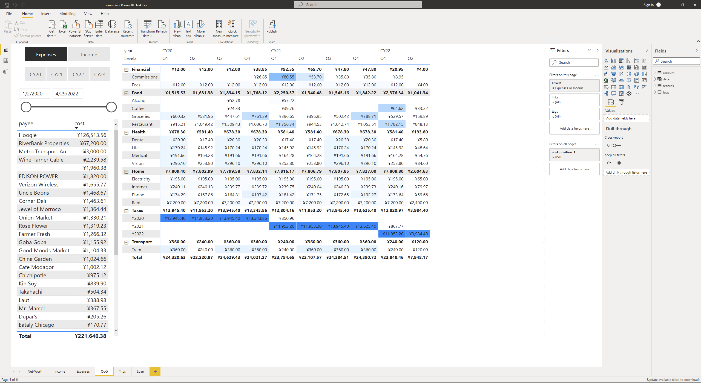

A Power BI Desktop dashboard for beancount data.

## initial setup
1. Install [*Power BI Desktop*](https://powerbi.microsoft.com/en-us/desktop/).
2. Install `python` along with `pandas` and `beancount`.
3. Open *Power BI* and go to `File > Options and Settings > Options > Python scripting`, either select the detected `python` instance or paste your installation path.
4. Open `example.pbix`, find `account` table from the `Fields` pandel on the right. Right click on it and select `Edit query`.

5. From the pop-up `Power Query Editor` winddow, `Queries` panel on the left side, change `data_path` to your beancount file and `currency` to your major currency.
6. Close the editor and the data will refresh automatically.

## how does it work?
1. *Net-Worth*: report for net worth based on relative accounts. It depand on the account metadata `asset-type`, which defines the account to be considered and its category. Here is an example: 
```text
2020-01-01 open Assets:US:BofA
  asset-type: "SAVING"
```
2. *Income* and *Expenses*: income or expense breaks down by time, account and payee.
 
3. *QoQ*: quarter over quarter data comparison.

